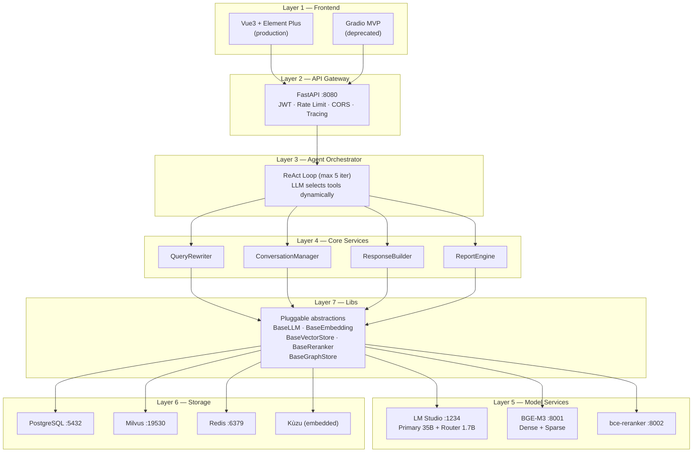
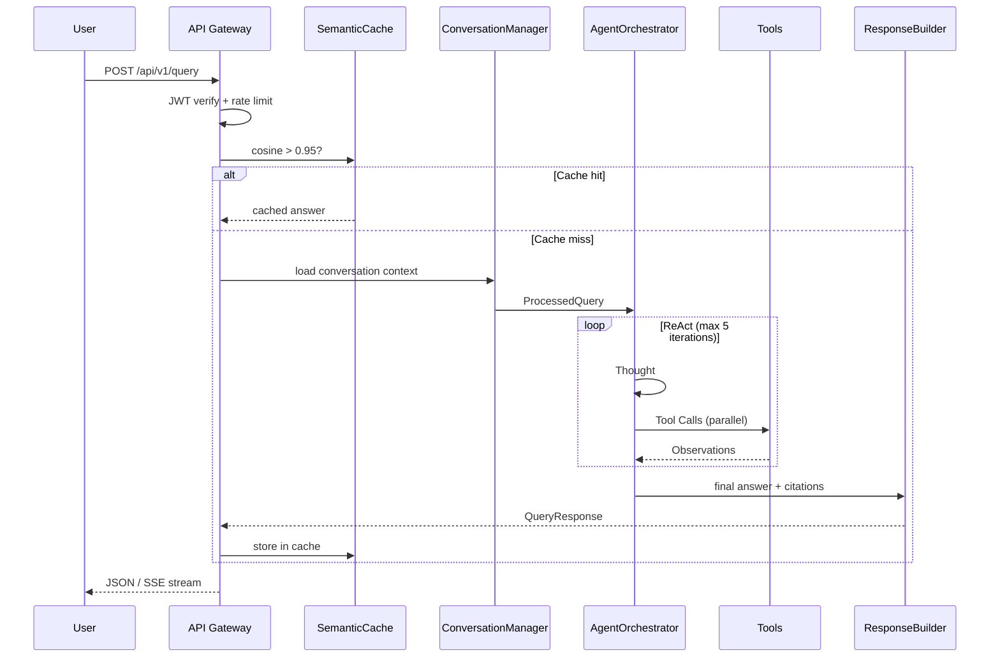
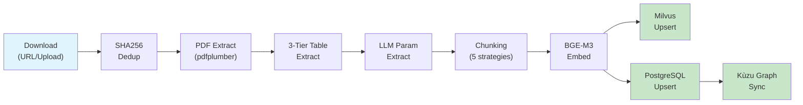
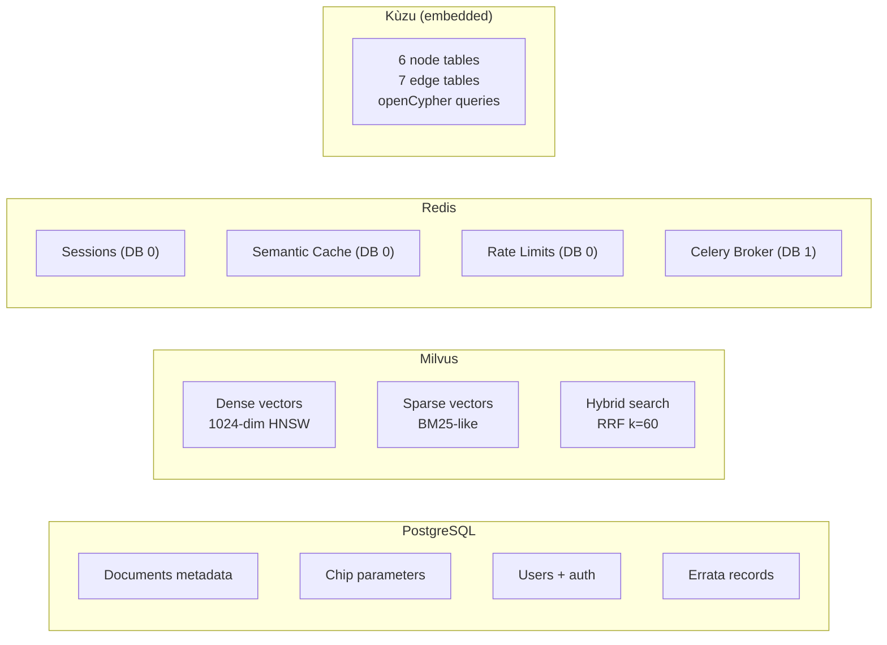

# Architecture Overview

> For a new team member to understand ChipWise Enterprise in 10 minutes.

## 1. Seven-Layer Architecture

## 2. Online Query Flow

## 3. Offline Ingestion Pipeline

Celery chains orchestrate the pipeline across 3 worker queues:
- **default/embedding** — main ingestion + embedding
- **heavy** — PaddleOCR (3 GB footprint, loaded on-demand)
- **crawler** — Playwright web scraping (rate-limited per domain)

## 4. Storage Topology

## 5. Key Design Decisions

### Why LM Studio?
All inference runs on a single AMD Ryzen AI 395 machine (128 GB RAM). LM Studio provides an OpenAI-compatible API for local model serving with zero data exfiltration — critical for semiconductor IP protection. The dual-model setup (35B primary + 1.7B router) balances quality with latency.

### Why Milvus Hybrid Search?
BGE-M3 produces both dense (semantic) and sparse (lexical) vectors in a single call. Milvus's native `hybrid_search()` with RRF fusion (k=60) combines semantic understanding with exact keyword matching — essential for chip part numbers like "STM32F407VGT6" that pure semantic search would miss.

### Why Kùzu Embedded?
Chip relationships (parameter inheritance, errata links, peripheral compatibility) are naturally a graph. Kùzu runs embedded in-process — no extra service to deploy or manage. openCypher queries enable multi-hop traversals that would require complex SQL JOINs. Synced from PostgreSQL after each ingestion.

### Why Celery with 3 Queues?
Different ingestion tasks have vastly different resource profiles: PaddleOCR needs 3 GB RAM (heavy queue), Playwright is I/O-bound with rate limits (crawler queue), embedding is GPU/CPU-bound (default queue). Separate queues with `worker_prefetch_multiplier=1` prevent one slow task from blocking others. `task_acks_late=True` ensures reliability on worker crashes.
